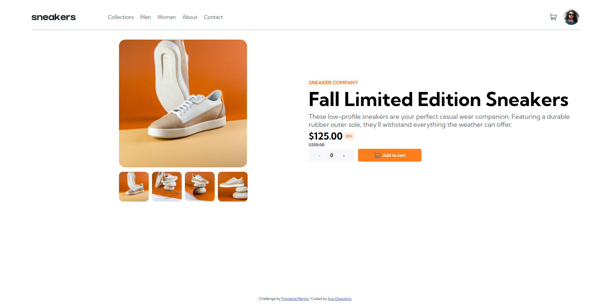

# sneakers-product

## Project setup
```
npm install
```

### Compiles and hot-reloads for development
```
npm run serve
```

### Compiles and minifies for production
```
npm run build
```

### Lints and fixes files
```
npm run lint
```

### Customize configuration
See [Configuration Reference](https://cli.vuejs.org/config/).


# Frontend Mentor - E-commerce product page solution

This is a solution to the [E-commerce product page challenge on Frontend Mentor](https://www.frontendmentor.io/challenges/ecommerce-product-page-UPsZ9MJp6). Frontend Mentor challenges help you improve your coding skills by building realistic projects.

## Table of contents

- [Overview](#overview)
  - [The challenge](#the-challenge)
  - [Screenshot](#screenshot)
  - [Links](#links)
- [My process](#my-process)
  - [Built with](#built-with)
  - [What I learned](#what-i-learned)
  - [Useful resources](#useful-resources)
- [Author](#author)

**Note: Delete this note and update the table of contents based on what sections you keep.**

## Overview

### The challenge

Users should be able to:

- View the optimal layout for the site depending on their device's screen size
- See hover states for all interactive elements on the page
- Open a lightbox gallery by clicking on the large product image
- Switch the large product image by clicking on the small thumbnail images
- Add items to the cart
- View the cart and remove items from it

### Screenshot



### Links

- Solution URL: [Solution URL](https://www.frontendmentor.io/challenges/ecommerce-product-page-UPsZ9MJp6/hub?share=true)
- Live Site URL: [Live Site](https://sneakers-product.onrender.com)

## My process

### Built with

- Semantic HTML5 markup
- CSS custom properties
- Flexbox
- [Vue](https://vuejs.org/) - JS library

### What I learned

I learned how to use the v-if conditional renderer. I also learned how to create a lightbox for an image gallery

### Useful resources

- [W3Schools](https://www.w3schools.com) - This helped me with the sidenav as well as the lightbox.


## Author

- Website - [Ayo Otutuloro](https://darkerarcher.netlify.app)
- Frontend Mentor - [@yourusername](https://www.frontendmentor.io/profile/darkerarcher)
- Twitter - [@yourusername](https://www.twitter.com/DarkerArcher)
